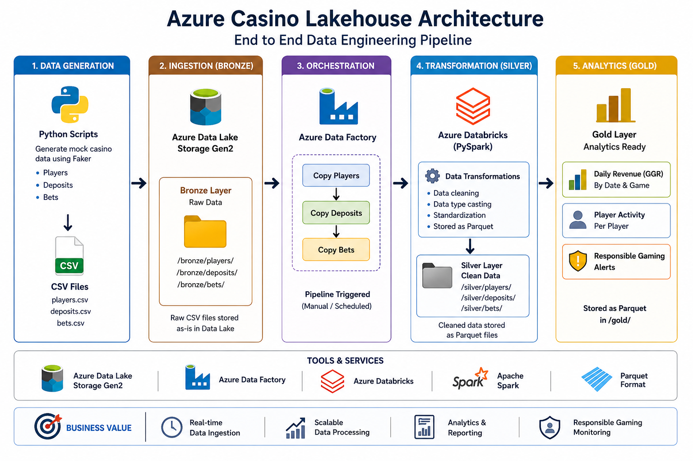
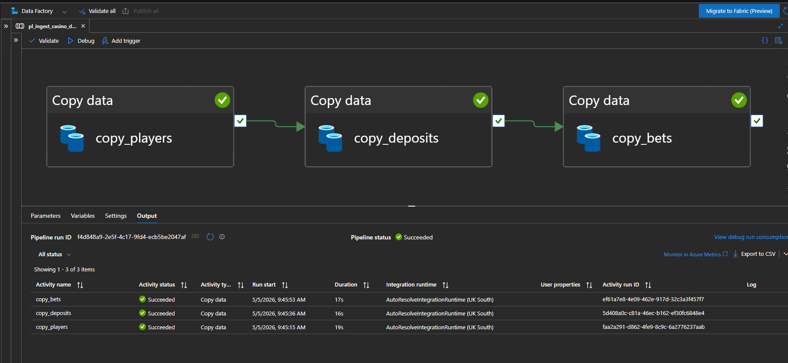
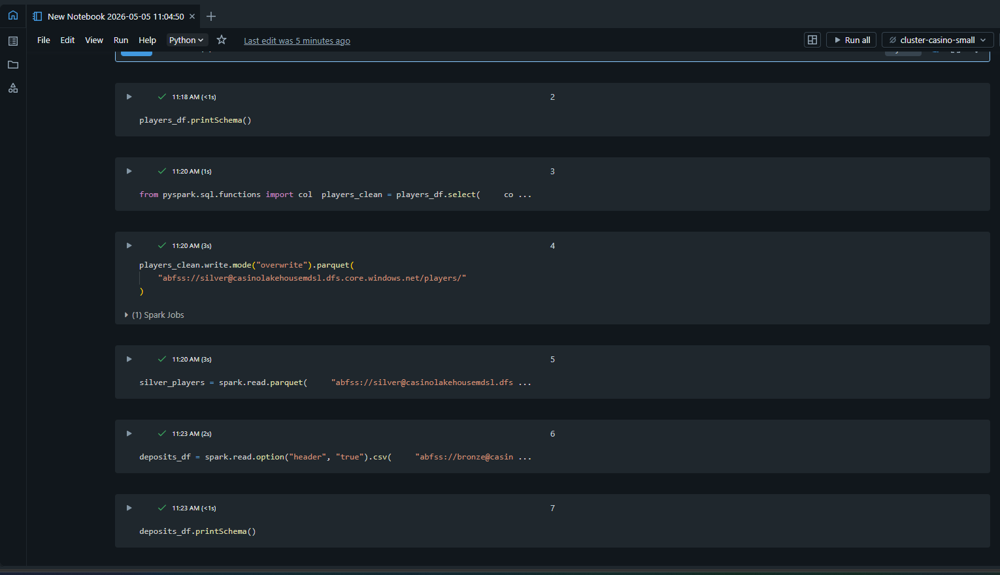
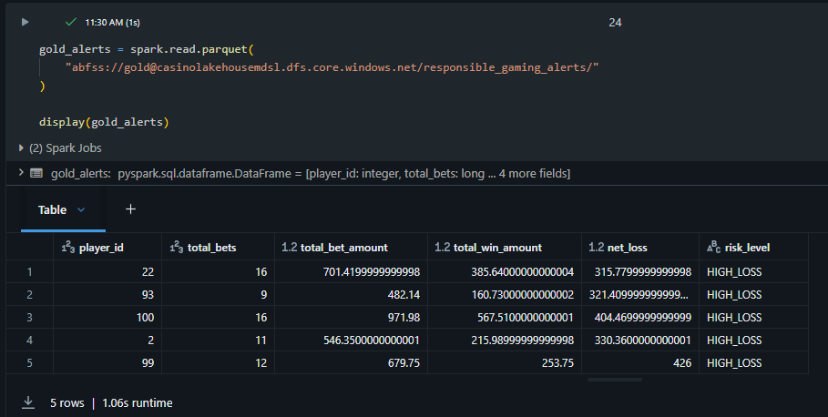
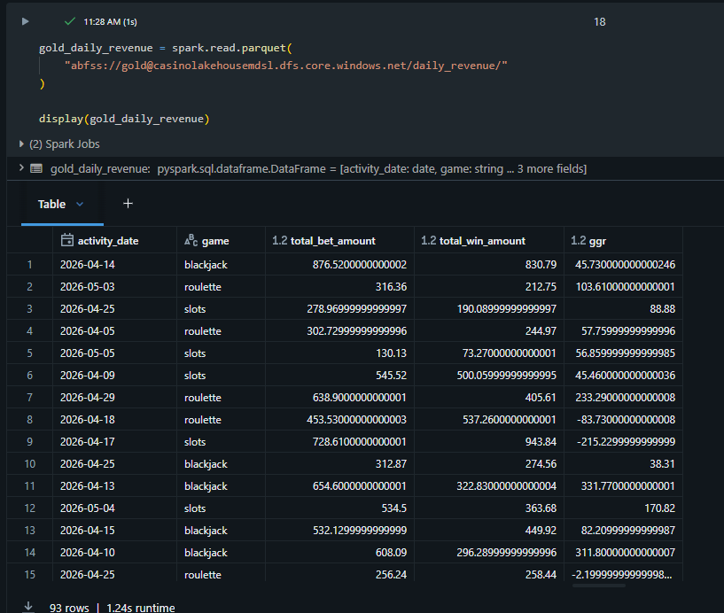
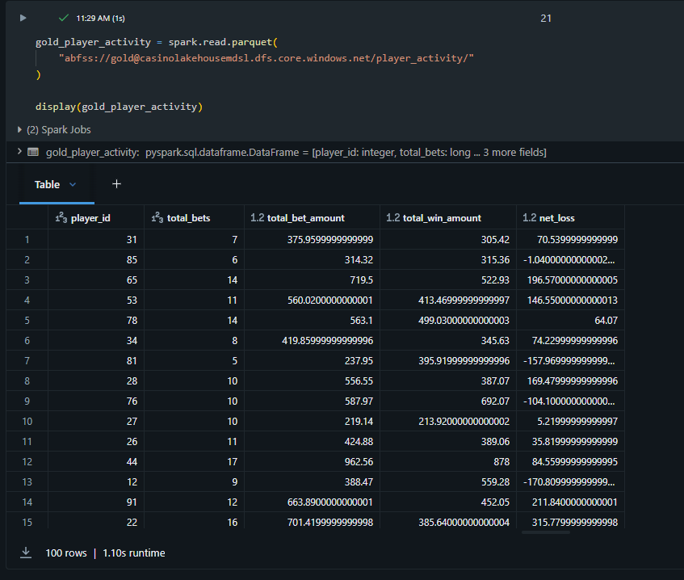

# Azure Casino Lakehouse

End-to-end Azure data engineering project simulating casino transactions and building a medallion lakehouse using Azure Data Factory, Azure Data Lake Storage, Azure Databricks, Delta Lake, and Azure SQL.

## Project Goals

- Ingest mock casino transaction data
- Store raw data in Azure Data Lake
- Transform data using Databricks and PySpark
- Build Bronze, Silver, and Gold layers
- Create analytics tables for revenue, player activity, fraud-risk, and responsible-gaming alerts

## Tech Stack

- Azure Data Lake Storage Gen2
- Azure Data Factory
- Azure Databricks
- PySpark
- Delta Lake
- Azure SQL Database
- Power BI optional

## Data Domains

- Players
- Bets
- Deposits
- Withdrawals
- Game sessions
- Bonuses
- Responsible-gaming alerts

## Data Pipeline

1. Generate mock casino data (Python + Faker)
2. Upload to Azure Data Lake (Bronze)
3. Use Azure Data Factory to orchestrate ingestion
4. Transform data in Databricks (Bronze → Silver)
5. Build analytics tables (Silver → Gold)

## Key Features

- Medallion architecture (Bronze/Silver/Gold)
- PySpark transformations
- Parquet optimization
- Revenue analytics (GGR)
- Player risk monitoring

## Architecture

## Data Pipeline

## Transformations (Databricks)

## Analytics Output

## 🚀 Project Summary

End-to-end Azure data engineering pipeline using:
- Azure Data Factory (orchestration)
- Azure Data Lake (storage)
- Databricks (PySpark transformations)
- Medallion architecture (Bronze/Silver/Gold)

Includes:
- Revenue analytics (GGR)
- Player activity tracking
- Responsible gaming alerts